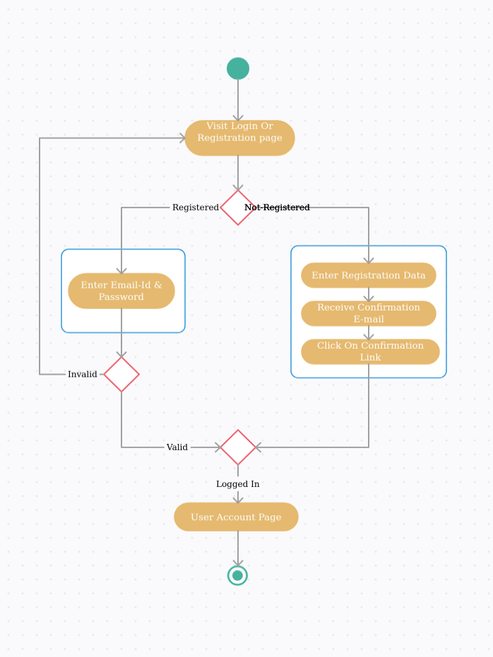

# Authenticated Application Threat Modeling
An interview exercise for Salsify Product Security candidates

## Goals
The goals of the exercise are:

1. To show that the candidate is familiar with common web application patterns and problems
2. To show that the candidate is familiar with threat modeling concepts and able to be hands-on in performing the exercise
3. To have a vehicle for deeper discussion in a face to face interview

## Overview
The deliverable of this exercise is a document u(format left up to the candidate) describing a threat model using STRIDE or similar methodology for the application component described below. There is no "right" answer, as noted above the exercise is a vehicle for further discussion, and therefore doesn't need to be perfect. We expect the time commitment for this should be a couple of hours. *If you uncover any issues or have questions not answered in this doc, please reach out.* We would gladly answer questions to avoid you spending time on unproductive facets of the exercise.

## Application Description
The application component for review is a simplified Registration and Login flow for a web based application.

Notes:
* This is not the complete application, components not listed above should be treated as out of scope, but feel free to note components or steps related to registration or login that you believe are missing for later discussion.
* Assume that once a user has logged in, the data visible to the user is potentially sensitive, and does not require any additional actions to be performed for the information to be visible. 
* The application is available to the internet, and does not require a VPN or other direct network connection to access.
* The application would be served using SSL / TLS 1.2
* The primary user is likely a desktop web browser, but could be coming from a mobile device as well.
* While STRIDE is listed as a methodology, please use whichever framework is most comfortable to you, we're not evaluating adherance to a particular method, but general approach and thoughtfulness. 

